### Task

The Nautilus DevOps Team has received a request from the Networking Team to set up a new public VPC to support a set of public-facing services. This VPC will host various resources that need to be accessible over the internet. As part of this setup, you need to ensure the VPC has public subnets with automatic IP assignment for resources. Additionally, a new EC2 instance will be launched within this VPC to host public applications that require SSH access. This setup will enable the Networking Team to deploy and manage public-facing applications.

Create a public VPC named `xfusion-pub-vpc`, and a subnet named `xfusion-pub-subnet` under the same, make sure public IP is being auto assigned to resources under this subnet. Further, create an EC2 instance named `xfusion-pub-ec2` under this VPC with instance type `t2.micro`. Make sure SSH port `22` is open for this instance and accessible over the internet.

### Solution

#### Create VPC and subnet

Go to VPC dashboard and create VPC with the following properties. The VPC and more option creates and automatically configures services as requested:

- Enable DNS hostnames and DNS resolution
- Create subnet
- Create internet gateway
- Attach internet gateway to VPC
- Create route table
- Create routes
- Associate route table
- Verifies route table creation

<br />

- Create VPC with specifying the name
  <br />
  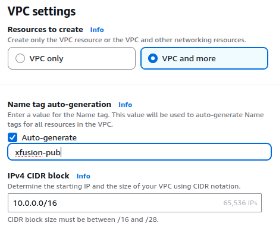

- Create public subnet
  <br />
  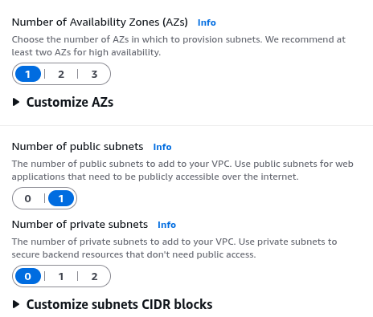

- You can see the preview in the right side
  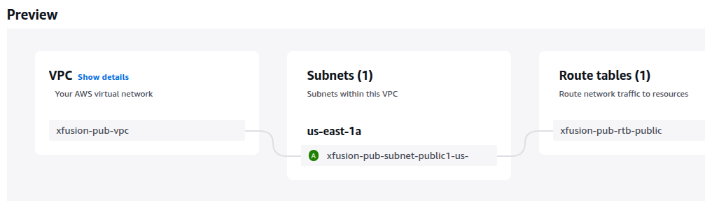
  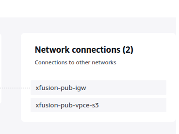

<br />

- Then enable auto assign public IPv4 addresss

  ```
  Select Subnets -> Select Actions -> Edit subnet settings
  ```

  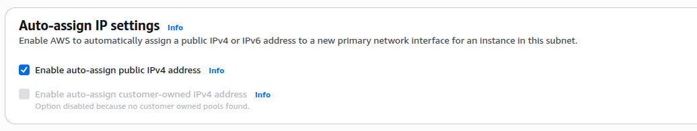

- Verify created route table and internet gateway
  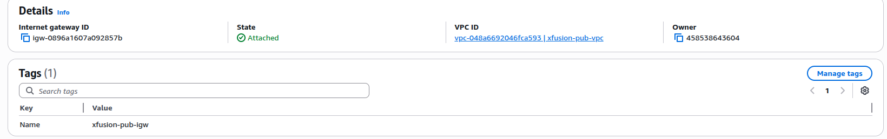
  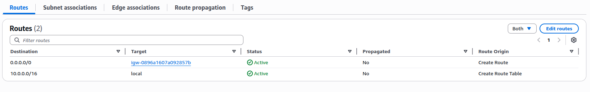

#### Create EC2 instance

- Add the name
  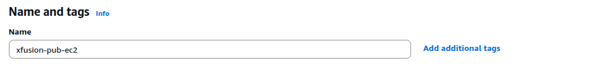

- Set the requested intance type
  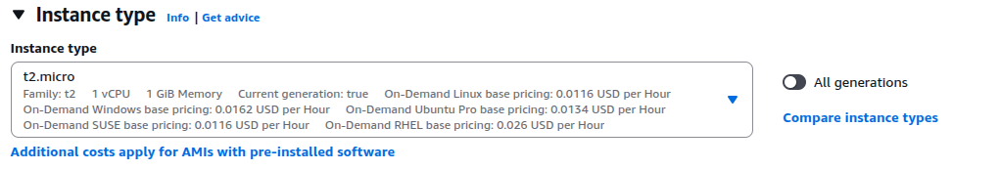

- Set the created vpc and subnet
  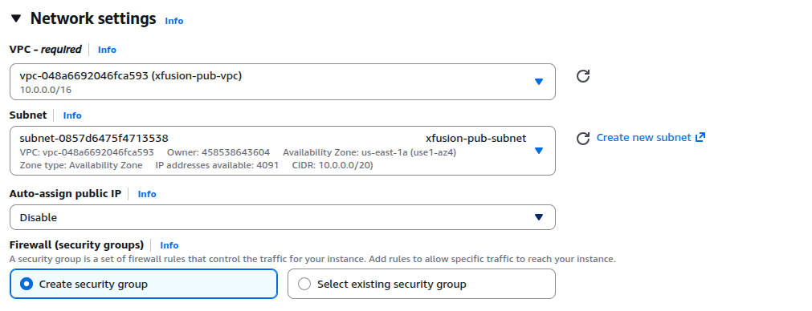

- Add ssh accesss with mentioned access level
  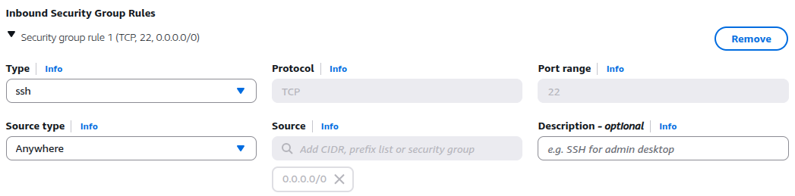
