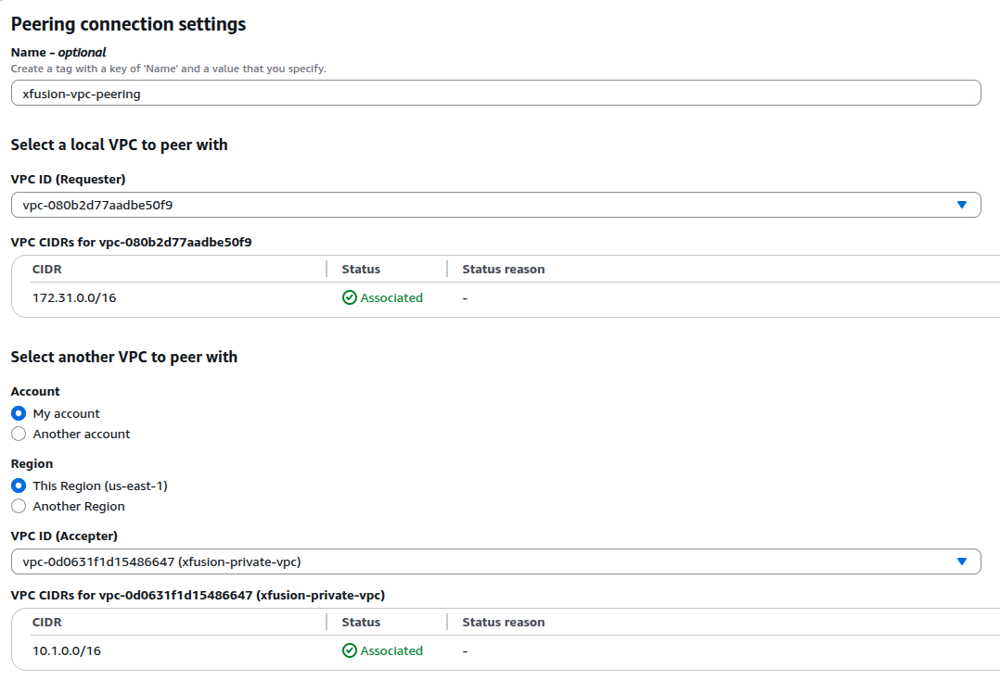
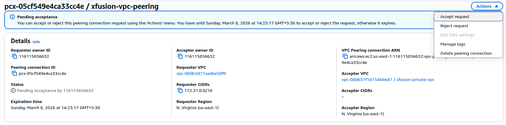
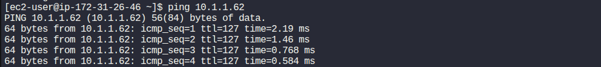

### Task

The Nautilus DevOps team has been tasked with demonstrating the use of VPC Peering to enable communication between two VPCs. One VPC will be a private VPC that contains a private EC2 instance, while the other will be the default public VPC containing a publicly accessible EC2 instance.

1. There is already an existing EC2 instance in the public vpc/subnet:
   Name: `xfusion-public-ec2`

2. There is already an existing Private VPC:
   Name: `xfusion-private-vpc`
   CIDR: `10.1.0.0/16`

3. There is already an existing Subnet in xfusion-private-vpc:
   Name: `xfusion-private-subnet`
   CIDR: `10.1.1.0/24`

4. There is already an existing EC2 instance in the private subnet:
   Name: `xfusion-private-ec2`

5. Create a Peering Connection between the Default VPC and the Private VPC:
   VPC Peering Connection Name: `xfusion-vpc-peering`

6. Configure Route Tables to enable communication between the two VPCs.
   Ensure the private EC2 instance is accessible from the public EC2 instance.

7. Test the Connection:

   Add `/root/.ssh/id_rsa.pub` public key to the public EC2 instance's `ec2-user'`s `authorized_keys` to make sure we are able to ssh into this instance from AWS client host. You may also need to update the security group of the private EC2 instance to allow ICMP traffic from the public/default VPC CIDR. This will enable you to ping the private instance from the public instance.
   SSH into the public EC2 instance and ensure that you can ping the private EC2 instance.

### Solution

- Create VPC peering connection

  ```
  VPC -> Peering Connections -> Create peering connections
  ```

  

  <br />

- After creating VPC peering connection, accept the pending acceptance shown in the dashboard.

  

  <br />

- Update route tables of each associated VPC to include the destination routes.

  ```
  Routes tables -> Select each route table id -> Edit routes
  ```

  Add routes to public VPC
  

  Add routes to private VPC
  

  <br />

- Update rules in the security of each EC2 instance with the respective rules.

  Add SSH access from anywhere for accessing public EC2 with SSH
  

  Add ICMP access from SG of EC2 from public VPC to allow ping from public EC2 instance.
  

- Setup ssh connection in the public EC2 instance.

  Select `Connect` on the public EC2 instance and connect using EC2 Instance Connect.

  Get the ssh public key from the aws client host.

  ```bash
  cat /root/.ssh/id_rsa.pub
  ```

  Then add that public key received above to the public EC2 instance's ec2-user's authorized_keys replacing `<key>`

  ```bash
  echo <key> >> ~/.ssh/authorized_keys
  ```

  <br />

- SSH into the public instance from the aws client host.

  

- Ping the private EC2 instance to validate.

  
