### Task

The Nautilus DevOps team is tasked with enabling internet access for an EC2 instance running in a private subnet. This instance should be able to upload a test file to a public S3 bucket once it can access the internet. To minimize costs, the team has decided to use a NAT Instance instead of a NAT Gateway.

The following components already exist in the environment:

1. A VPC named `devops-priv-vpc` and a private subnet named `devops-priv-subnet` have been created.
2. An EC2 instance named `devops-priv-ec2` is already running in the private subnet.
3. The EC2 instance is configured with a cron job that uploads a test file to the S3 bucket `devops-nat-24094` every minute. Upload will only succeed once internet access is established.

Your task is to:

Create a new public subnet named `devops-pub-subnet` in the existing VPC.
Launch a NAT Instance in the public subnet using an Amazon Linux 2 AMI and name it `devops-nat-instance`. Configure this instance to act as a NAT instance. Make sure to use a custom security group for this instance.
After the configuration, verify that the test file `devops-test.txt` appears in the S3 bucket `devops-nat-24094`. This indicates successful internet access from the private EC2 instance via the NAT Instance.

### Solution

- Create a public subnet associated to the private VPC.

  ```
  VPC -> Subnets -> Create
  ```

  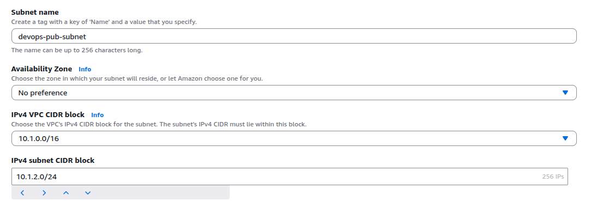

  <br />

- Create a new route table. Attach it to the private VPC

  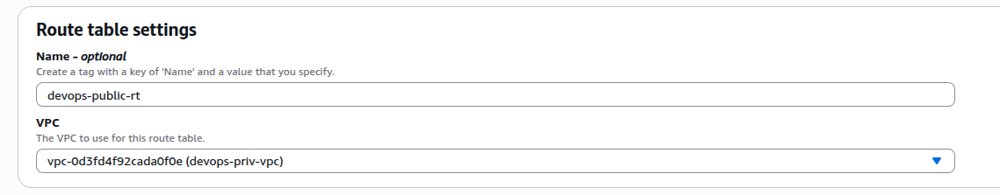

  <br />

- Associate the public subnet with newly created route table

  ```
  Select route table -> Subnet associations -> Edit subnet associations (Explicit subnet associations)
  ```

  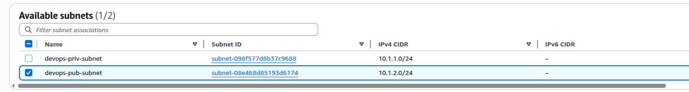

  <br />

- Create new internet gateway. Attach to the private VPC

  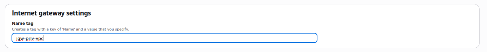

  <br />

- Add routes for internet traffic with internet gateway

  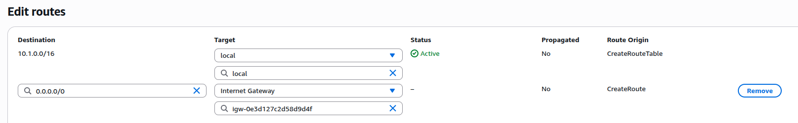

  <br />

- Now verify with the resource map of the VPC

  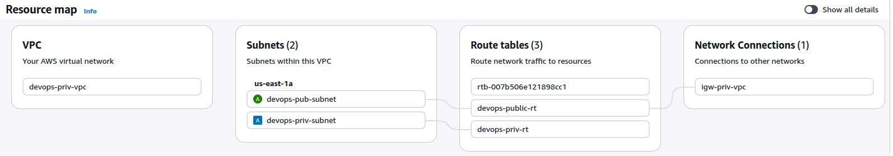

    <br />

- Create and configure NAT instance. Ref [Enable private resources to communicate outside the VPC](https://docs.aws.amazon.com/vpc/latest/userguide/work-with-nat-instances.html)

  Create a new EC2 and configure it to act as NAT instance

  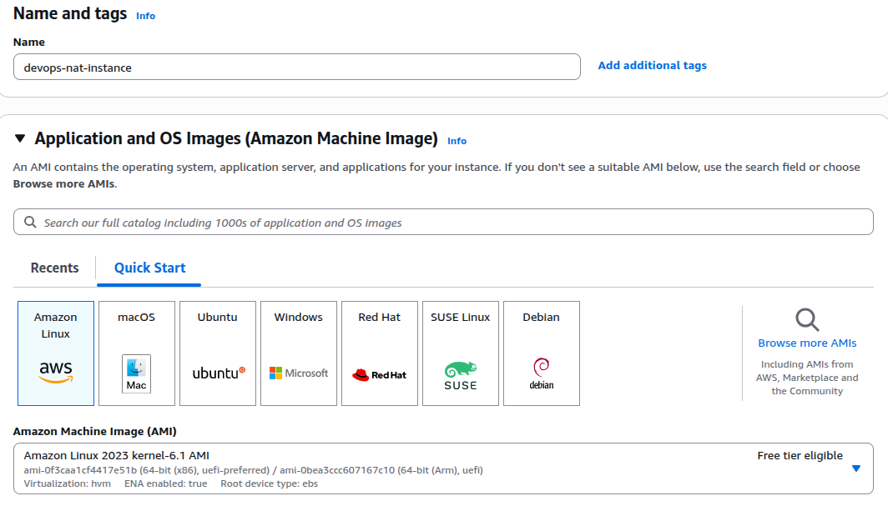
  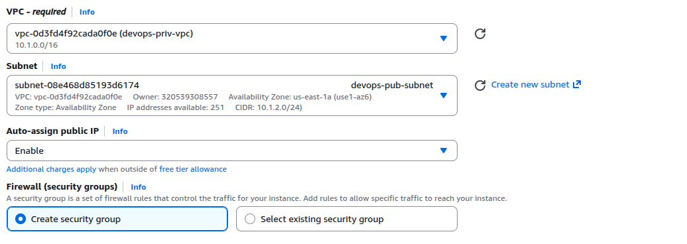

  <br />

- Allow inbound HTTP/HTTPS traffic from the services in the private subnet

  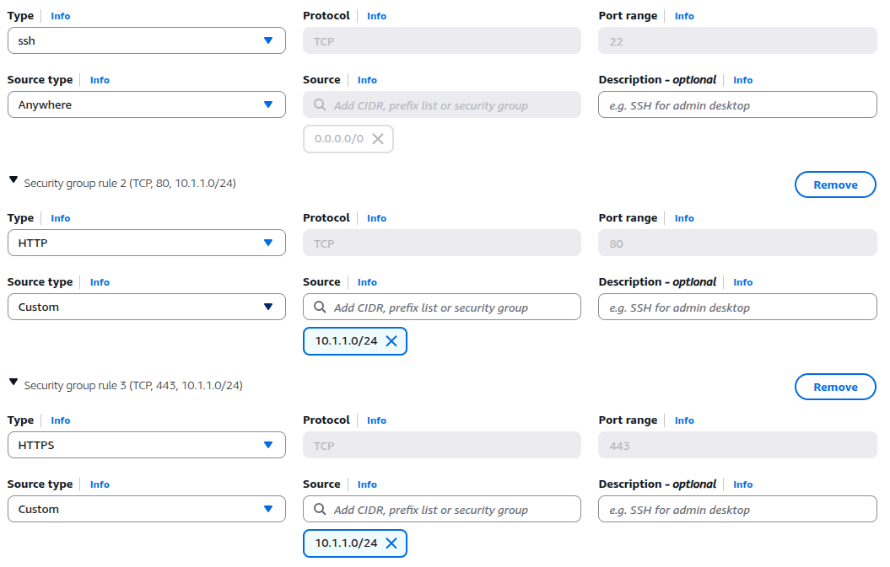

  <br />

- Allow outbound HTTP/HTTPS traffic to internet. Go to the created SG and add outbound rules

  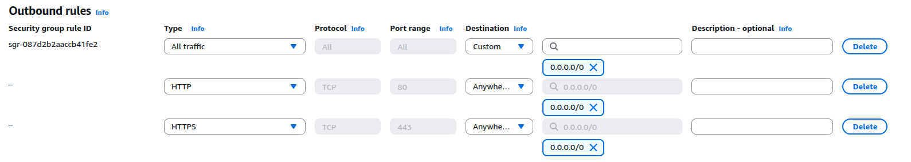

  <br />

- SSH into the EC2 instance and configure as a NAT instance using SSH or AWS EC2 Instance Connect

  ```bash
  # Enable iptables
  sudo yum install iptables-services -y
  sudo systemctl enable iptables
  sudo systemctl start iptables
  ```

  Enable IP forwarding such that it persists after reboot.
  Add following to `/etc/sysctl.d/custom-ip-forwarding.conf`

  ```
  net.ipv4.ip_forward=1
  ```

  Apply the configuration

  ```bash
  sudo sysctl -p /etc/sysctl.d/custom-ip-forwarding.conf
  ```

  Get the primary network interface

  ```bash
  netstat -i
  ```

  Configure NAT

  ```bash
  sudo /sbin/iptables -t nat -A POSTROUTING -o eth0 -j MASQUERADE
  sudo /sbin/iptables -F FORWARD
  sudo service iptables save
  ```

- Disable source/destination checks

  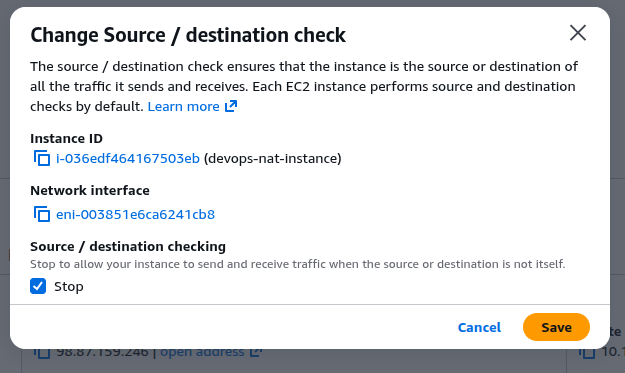

  <br />

- Add route to the private subnet that sends internet traffic to NAT instance

  ```
  NAT Instance -> Actions -> Networking -> Change source/destination checks
  ```

  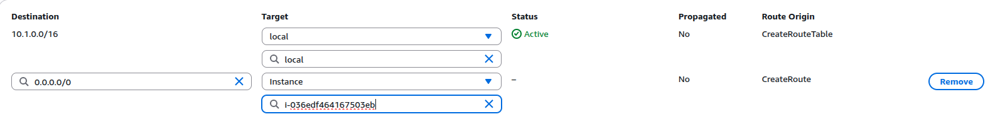

  <br />

- Verify the file in the S3 bucket

  
