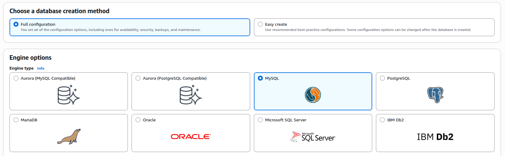
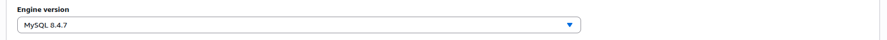
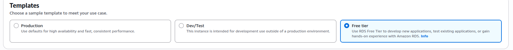
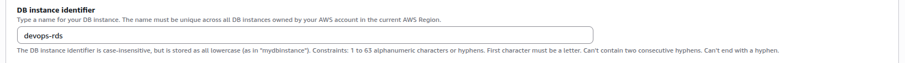
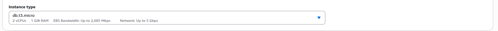
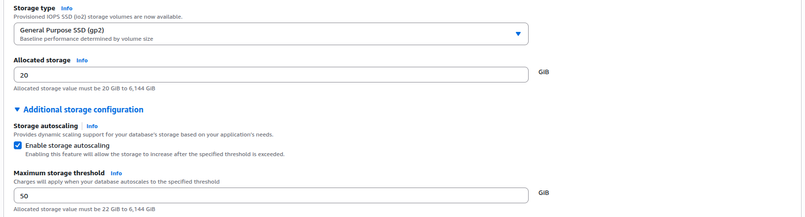

### Task

The Nautilus Development Team is working on a new application feature that requires a reliable and scalable database solution. To facilitate development and testing, they need a new private RDS instance. This instance will be used to store critical application data and must be provisioned using the AWS free tier to minimize costs during the initial development phase. The team has chosen MySQL as the database engine due to its compatibility with their existing systems. The DevOps team has been tasked with setting up this RDS instance, ensuring that it is correctly configured and available for use by the development team.

As a member of the Nautilus DevOps Team, your task is to perform the following:

1. **Provision a Private RDS Instance:** Create a new private RDS instance named `devops-rds` using a `sandbox` template, further it must be a `db.t3.micro` type instance.
2. **Engine Configuration:** Use the `MySQL` engine with version `8.4.x`.
3. **Enable Storage Autoscaling:** Enable storage autoscaling and set the threshold value to `50GB`. Keep the rest of the configurations as default.
4. **Instance Availability:** Ensure the instance is in the `available` state before submitting this task.

### Solution

```
Aurora and RDS -> Databases -> Create database
```

- Select Full Configuration. This allows to choose the storage threshold. Select `MySQL`.

  

  <br />

- Select `MySQL` version.

  

  <br />

- Select Free tier template. `sandbox` template is not available. It is only available to paid customers.

  

  <br />

- Add database instance name.

  

  <br />

- Select the database instance type.

  

  <br />

- Replace the threshold value.

  ```
  Storage -> Additional storage Configuration
  ```

  
