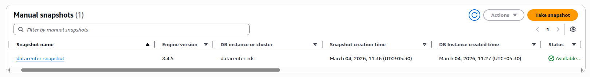
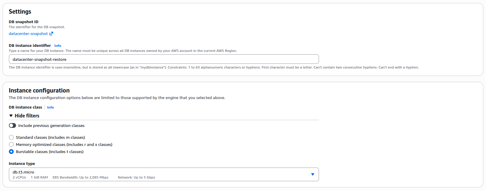
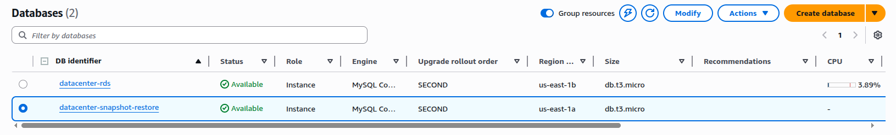

### Task

The Nautilus Development Team is preparing for a major update to their database infrastructure. To ensure a smooth transition and to safeguard data, the team has requested the DevOps team to take a snapshot of the current RDS instance and restore it to a new instance. This process is crucial for testing and validation purposes before the update is rolled out to the production environment. The snapshot will serve as a backup, and the new instance will be used to verify that the backup process works correctly and that the application can function seamlessly with the restored data.

As a member of the Nautilus DevOps Team, your task is to perform the following:

1. **Take a Snapshot:** Take a snapshot of the `datacenter-rds` RDS instance and name it `datacenter-snapshot` (please wait `datacenter-rds` instance to be in `available` state).
2. **Restore the Snapshot:** Restore the snapshot to a new RDS instance named `datacenter-snapshot-restore`.
3. **Configure the New RDS Instance:** Ensure that the new RDS instance has a class of `db.t3.micro`.
4. **Verify the New RDS Instance:** The new RDS instance must be in the `Available` state upon completion of the restoration process

### Solution

- Wait until the state of the db instance is `available`. Once it is `available` create a snapshot

  ```bash
  aws rds create-db-snapshot --db-instance-identifier datacenter-rds --db-snapshot-identifier datacenter-snapshot
  ```

  

  <br />

  Note: You can take a snapshot using aws console by,

  ```
  Aurora -> Snapshots -> Take snapshot
  ```

- Once the snapshot is created, restore it

  ```
  Select snapshot -> Actions -> Restore snapshot
  DB Engine - MySQL Community
  Availability and durability - Single-AZ DB instance deployment (1 instance)
  ```

  

  <br />

- Wait until the state is `available`

  
