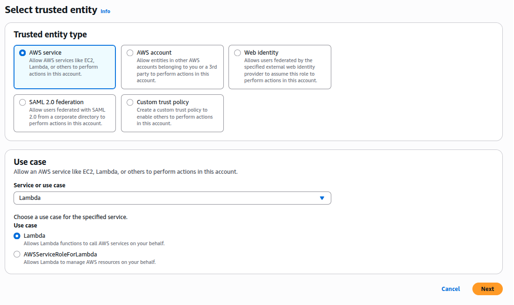
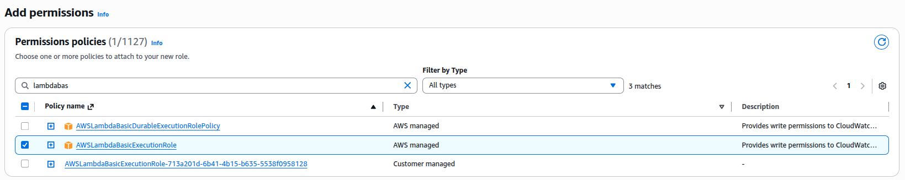
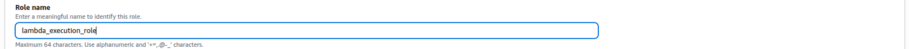
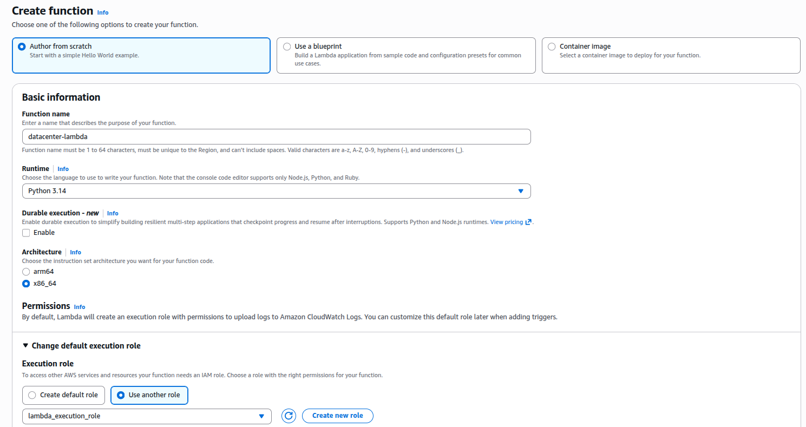
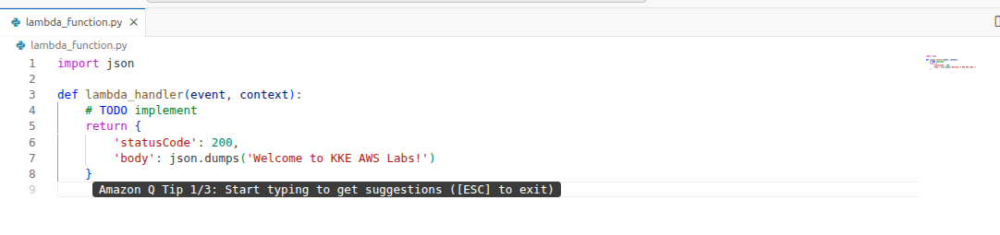
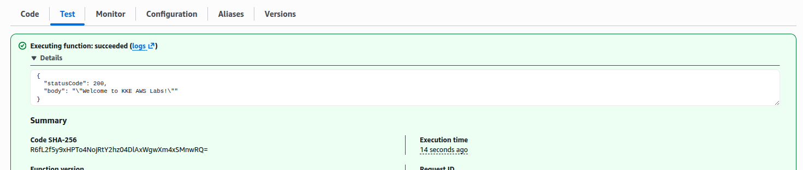

### Task

The Nautilus DevOps team is embracing serverless architecture by integrating AWS Lambda into their operational tasks. They have decided to deploy a simple Lambda function that will return a custom greeting to demonstrate serverless capabilities effectively. This function is crucial for showcasing rapid deployment and easy scalability features of AWS Lambda to the team.

1. Create Lambda Function: Create a Lambda function named `datacenter-lambda`.
2. Runtime: Use the Runtime `Python`.
3. Deploy: The function should print the body `Welcome to KKE AWS Labs!`.
4. Status Code: Ensure the status code is `200`.
5. IAM Role: Create and use the IAM role named `lambda_execution_role`.

Use the AWS Console to complete this task.

### Solution

- Create role

  ```
  IAM -> Roles -> Create role
  ```

  

  <br />

  Add permissions

  

  <br />

  Add name

  

  <br />

- Create lambda function

  ```
  Lambda -> Create function
  ```

  Make the runtime as `python` and change the role to the newly created role

  

  <br />

  Update the code inside the lambda hanlder

  

  <br />

  Creat a test and validate.

  
