### Task

The Nautilus DevOps team needs a new private RDS instance for their application. They need to set up a MySQL database and ensure that their existing EC2 instance can connect to it. This will help in managing their database needs efficiently and securely.

1. Task Details:
   1. Create a private RDS instance named `nautilus-rds` using a `sandbox template.
   2. The engine type must be `MySQL v8.4.5`, and it must be a `db.t3.micro` type instance.
   3. The master username must be `nautilus_admin` with an appropriate password.
   4. The RDS storage type must be `gp2`, and the storage size must be `5GiB`.
   5. Create a database named `nautilus_db`.
   6. Keep the rest of the configurations as `default`. Ensure the instance is in `available` state.
   7. Adjust the security groups so that the `nautilus-ec2` instance can connect to the RDS on `port 3306` and also open port `80` for the instance.

2. An EC2 instance named `nautilus-ec2` exists. Connect to this instance from the AWS console. Create an SSH key `(/root/.ssh/id_rsa)` on the `aws-client` host if it doesn't already exist. Add the public key to the authorized keys of the `root` user on the EC2 instance for password-less SSH access.

3. There is a file named `index.php` under the `/root` directory on the `aws-client` host. Copy this file to the `nautilus-ec2` instance under the `/var/www/html/` directory. Make the appropriate changes in the file to connect to the RDS.

4. You should see a `Connected successfully` message in the browser once you access the instance using the public IP.

### Solution

- Setup RDS

  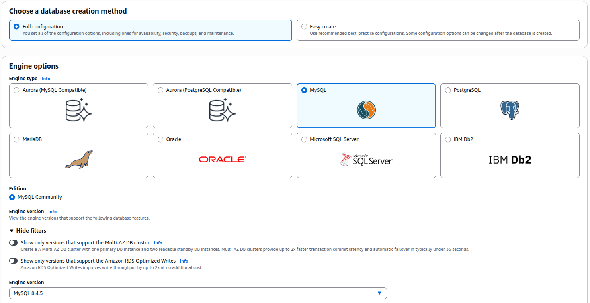

  <br />

  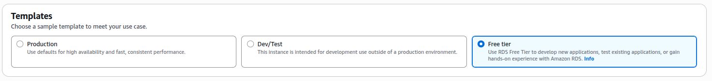

  <br />

  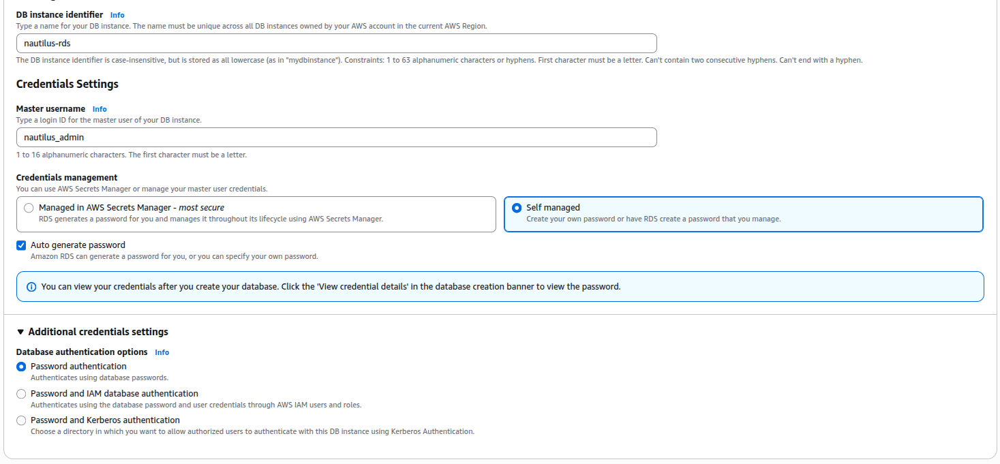

  <br />

  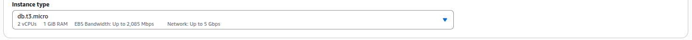

  <br />

  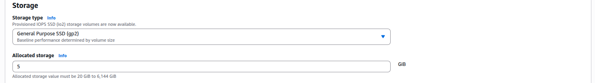

  <br />

  To create a database, expand `Additional Configuration` at the bottom of the options.

  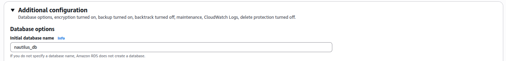

  <br />

  Be sure to save the db password

  On conectivity, add connection to `EC2` instance. This will automatically create necessary security group rules

  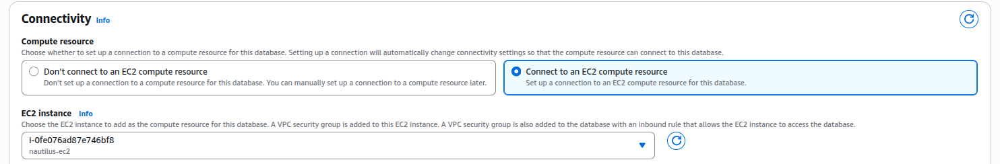

  <br />

  Create new security group for the VPC attached to RDS instance

  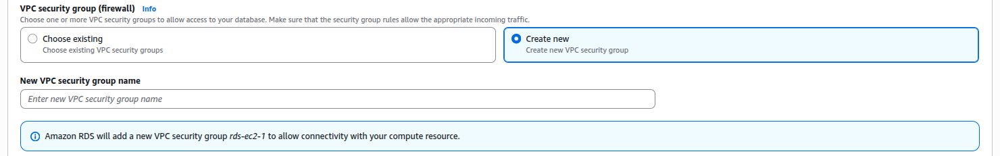

  <br />

  Go to the EC2 instance and update the inbound rules of attached security group to open port `80` and SSH traffic

  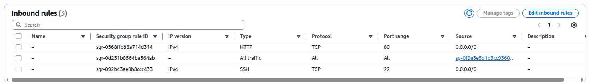

  <br />

- Connect to the existing EC2 instance as `root` user using console and configure SSH.

  Copy the public key on the `aws-client`

  ```bash
  cat /root/.ssh/id_rsa.pub
  ```

  Paste the public key to the authized keys on the EC2 instance

  ```bash
  vi /root/.ssh/authorized_keys
  ```

  <br />

- Copy the `index.php` file and replace the configuration

  ```bash
  scp /root/index.php root@18.206.173.185:/var/www/html/
  ```

  ```
  Aurora and RDS -> Databases -> select database -> Connectivity and security -> Get the rds host
  ```

  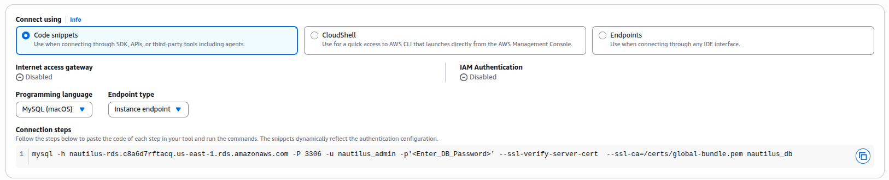

  <br />

  Replace the configuration data (dbname, dbuser, dbpass, dbhost) with appropriate details

  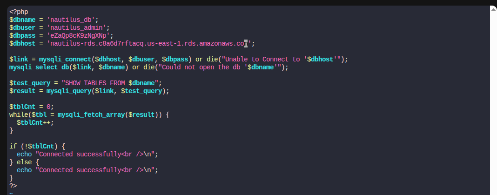

  <br />

- Verify the task is completed successfully by visiting the public ip of the EC2 instance. It should show `Connected successfully`
