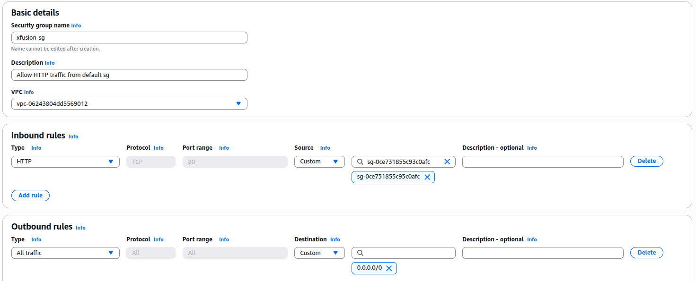
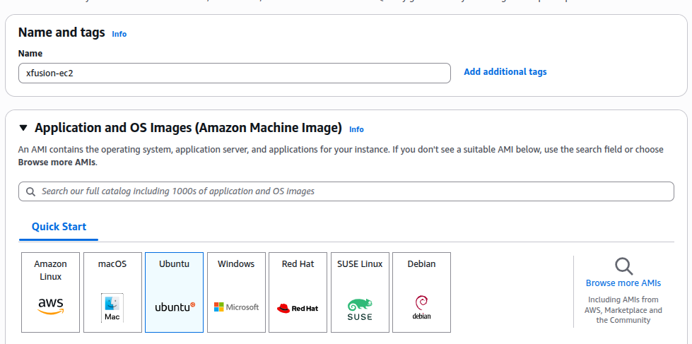
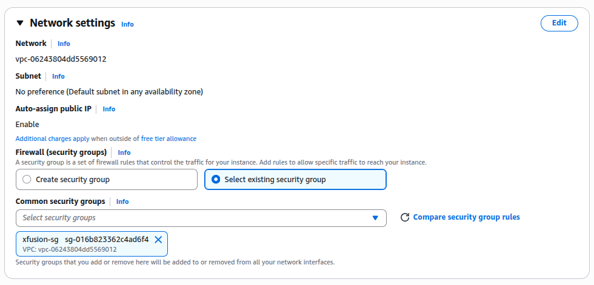
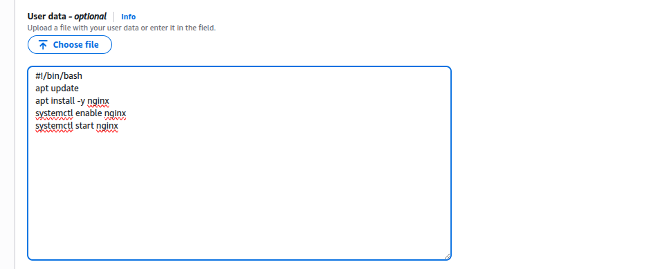
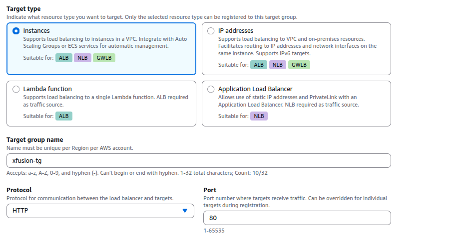
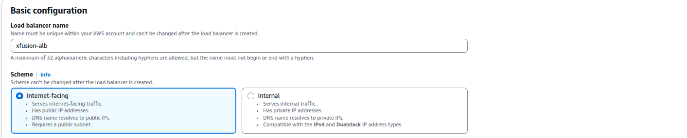
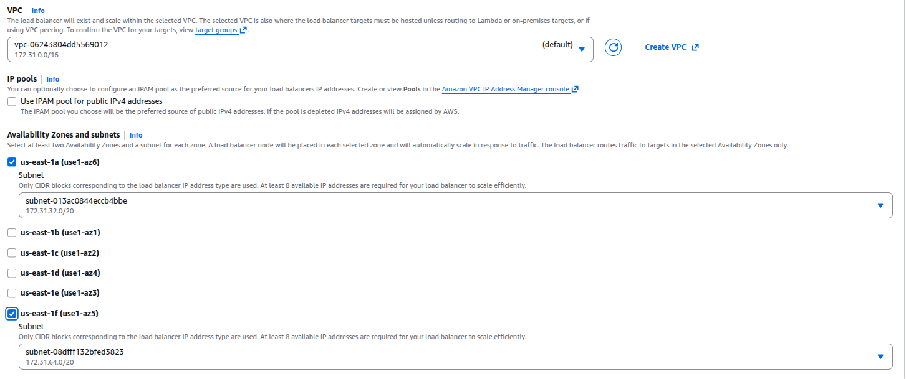
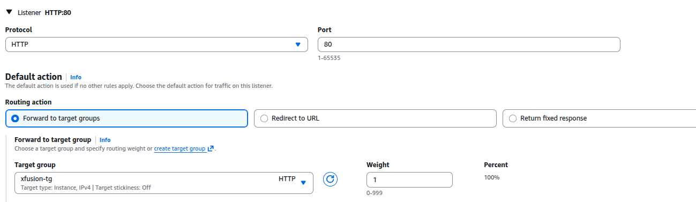

### Task

The Nautilus Development Team needs to set up a new EC2 instance and configure it to run a web server. This EC2 instance should be part of an Application Load Balancer (ALB) setup to ensure high availability and better traffic management. The task involves creating an EC2 instance, setting up an ALB, configuring a target group, and ensuring the web server is accessible via the ALB DNS.

1. **Create a security group:** Create a security group named `xfusion-sg` to open port `80` for the default security group (which will be attached to the ALB). Attach `xfusion-sg` security group to the EC2 instance.

2. **Create an EC2 instance:** Create an EC2 instance named `xfusion-ec2`. Use any available Ubuntu AMI to create this instance. Configure the instance to run a user data script during its launch.

   This script should:
   - Install the Nginx package.
   - Start the Nginx service.
   - Set up an Application Load Balancer: Set up an Application Load Balancer named xfusion-alb. Attach default security group to the same.

3. **Create a target group:** Create a target group named `xfusion-tg`.

4. **Route traffic:** The ALB should route traffic on port `80` to port `80` of the `xfusion-ec2` instance.

5. **Security group adjustments:** Make appropriate changes in the `default` security group attached to the ALB if necessary. Eventually, the Nginx server running under `xfusion-ec2` instance must be accessible using the ALB DNS.

### Solution

- Create the SG

  

   

- Create EC2 and setup the configuration

  

   

  

   

  

   

- Select the target group and include the ec2 as pending

  

   

- Create the ALB. Make sure to add the availability zone of the ec2 instance

  

   

  

   

  

   

- Allow HTTP traffic from anywhere for `default` sg which is attached to the ALB.

- Verify the task nginx is running by visiting the DNS of the ALB.
