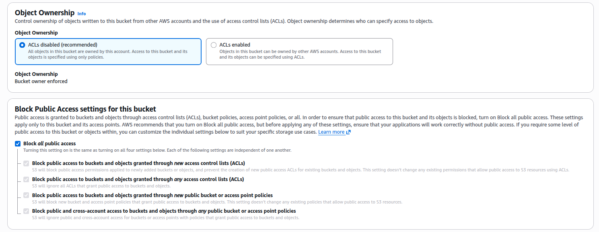
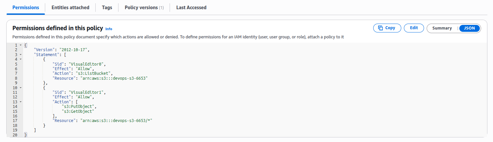
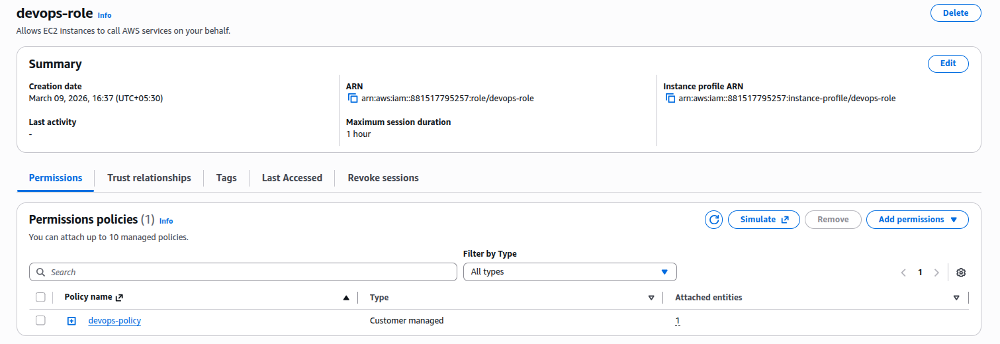
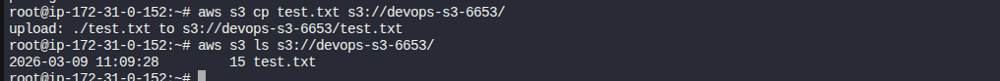

### Task

The Nautilus DevOps team needs to set up an application on an EC2 instance to interact with an S3 bucket for storing and retrieving data. To achieve this, the team must create a private S3 bucket, set appropriate IAM policies and roles, and test the application functionality.

1. EC2 Instance Setup:
   - An instance named `devops-ec2` already exists.
   - The instance requires access to an S3 bucket.

2. Setup SSH Keys:
   - Create new SSH key pair (id_rsa and id_rsa.pub) on the `aws-client` host and add the public key to the `root` user's authorized keys on the EC2 instance.

3. Create a Private S3 Bucket:
   - Name the bucket `devops-s3-6653`.
   - Ensure the bucket is private.

4. Create an IAM Policy and Role:
   - Create an IAM policy allowing s3:PutObject, s3:ListBucket and s3:GetObject access to nautilus-s3-27635.
   - Create an IAM role named `devops-role`.
   - Attach the policy to the IAM role.
   - Attach this role to the `devops-ec2` instance.

5. Test the Access:
   - SSH into the EC2 instance and try to upload a file to `devops-s3-6653` bucket using following command:

     ```bash
     aws s3 cp <your-file> s3://devops-s3-6653/
     ```

   - Now run following command to list the upload file:

     ```bash
     aws s3 ls s3://devops-s3-6653/
     ```

### Solution

- Create SSH keys

  On `aws-client`

  ```bash
  ssh-keygen -t rsa
  ```

- Add pubilc ssh key on the ec2 instance using EC2 Instance Connect.

  On `aws-client`

  ```bash
  cat /root/.ssh/id_rsa.pub
  ```

  On EC2 Console

  ```bash
  sudo -i
  vi /root/.ssh/authorized_keys
  ```

- Create the S3 bucket.

  By default the bucket is private. These ensure the bucket is private.

  

  <br />

- Create a policy with the specified permissions.

  ```
  IAM -> Policies -> Create Policy
  ```

  

  <br />

- Create a role with the above policy

  ```
  IAM -> Roles -> Create role
  ```

  

  <br />

- Attach the role with the EC2

  ```
  EC2 -> Select instance -> Actions -> Security -> Modify IAM role
  ```

- Test the access

  SSH into the EC2 from aws-client

  ```bash
  ssh root@<ec2-public-ipv4>
  ```

  

  <br />
