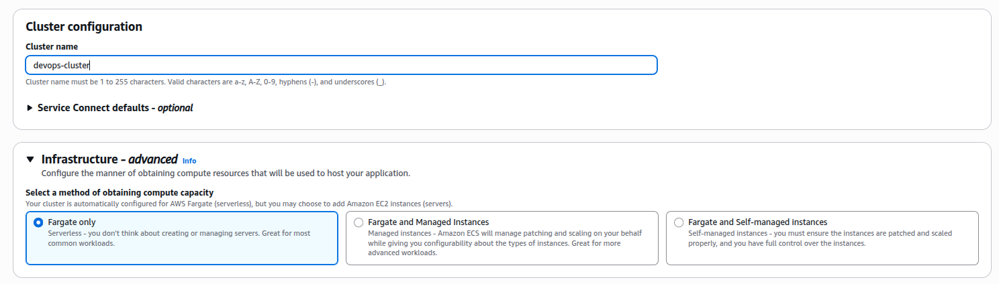
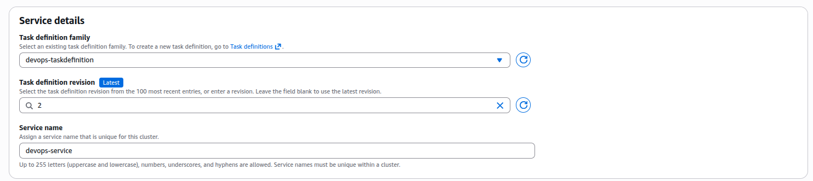
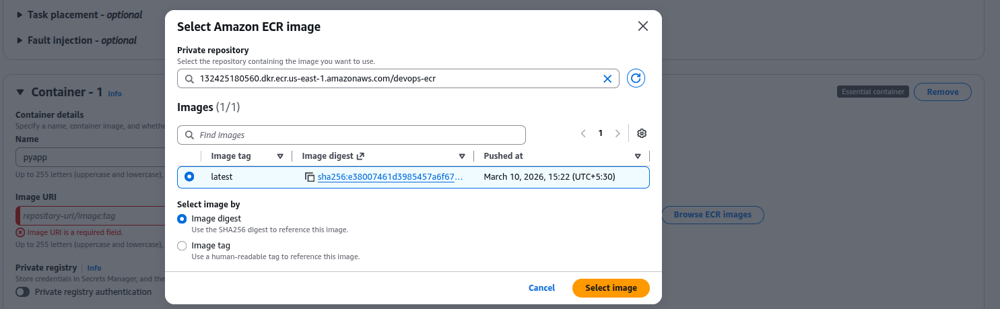
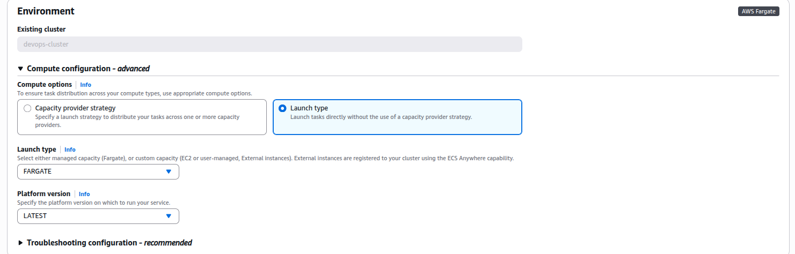
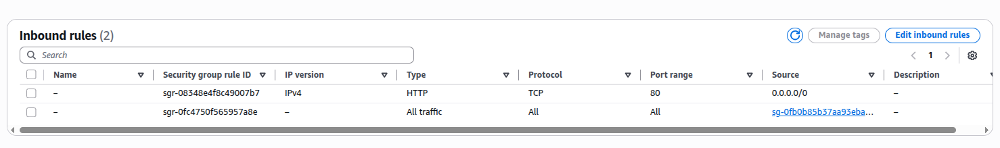

### Task

The Nautilus DevOps team is tasked with deploying a containerized application using Amazon's container services. They need to create a private Amazon Elastic Container Registry (ECR) to store their Docker images and use Amazon Elastic Container Service (ECS) to deploy the application. The process involves building a Docker image from a given Dockerfile, pushing it to the ECR, and then setting up an ECS cluster to run the application.

1. Create a Private ECR Repository:
   - Create a private ECR repository named `devops-ecr` to store Docker images.

2. Build and Push Docker Image:
   - Use the Dockerfile located at `/root/pyapp` on the `aws-client` host.
   - Build a Docker image using this Dockerfile.
   - Tag the image with `latest` tag.
   - Push the Docker image to the `devops-ecr` repository.

3. Create and Configure ECS cluster:
   - Create an ECS cluster named `devops-cluster` using the Fargate launch type.

4. Create an ECS Task Definition:
   - Define a task named `devops-taskdefinition` using the Docker image from the `devops-ecr` ECR repository.
   - Specify necessary CPU and memory resources.

5. Deploy the Application Using ECS Service:
   - Create a service named `devops-service` on the `devops-cluster` to run the task.
   - Ensure the service runs at least one task.

### Solution

- Create a private erc repository

  ```
  Amazon ECR -> Create repository
  ```

- Change directory to the folder container Dockerfile and build the docker image

  ```bash
  cd /root/pyapp/

  docker build -t pyapp:latest .

  showcreds

  docker tag pyapp <account-id>.dkr.ecr.us-east-1.amazonaws.com/devops-ecr

  aws ecr get-login-password --region "us-east-1" | docker login --username AWS --password-stdin <aws_account_id>.dkr.ecr.us-east-1.amazonaws.com

  docker push <account-id>.dkr.ecr.us-east-1.amazonaws.com/devops-ecr
  ```

- Create and Configure ECS cluster

  ```
  ECS -> Clusters -> Create cluster
  ```

  

  <br />

- Create ECS task definition

  ```
  ECS -> Task definitions -> Create new task definition
  ```

  

  <br />

  

  <br />

- Create service

  ```
  ECS -> Clusters -> Select cluster -> Services -> Create
  ```

  

  <br />

- Allow HTTP inboud traffic to the security group (default) attached to the vpc.

  

  <br />

- Verify

  Get pubic ip and visit the ip to verify.

  ```
  ECS -> Cluesters -> Select cluster -> Tasks -> Select task
  ```

  It should show `Welcome to KKE AWS cloud labs!`
