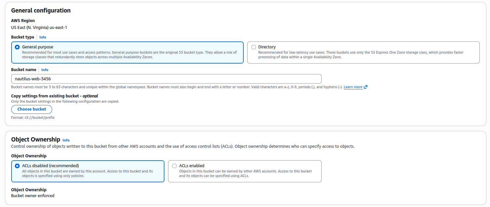
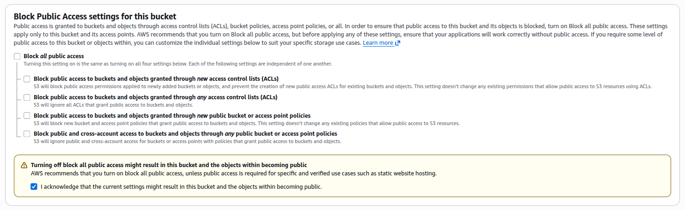
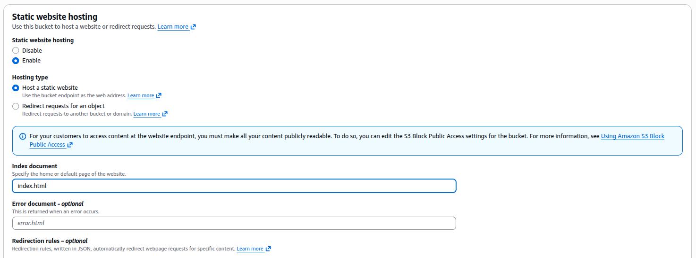
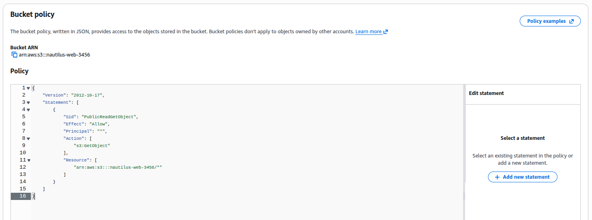
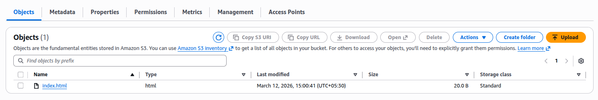

### Task

The Nautilus DevOps team has been tasked with creating an internal information portal for public access. As part of this project, they need to host a static website on AWS using an S3 bucket. The S3 bucket must be configured for public access to allow external users to access the static website directly via the S3 website URL.

Task Requirements:

1. Create an S3 bucket named `nautilus-web-3456`.
2. Configure the S3 bucket for static website hosting with `index.html` as the index document.
3. Allow public access to the bucket so that the website is publicly accessible.
4. Upload the `index.html` file from the `/root/` directory of the AWS client host to the S3 bucket.
5. Verify that the website is accessible directly through the S3 website URL.

### Solution

Ref: [Tutorial: Configuring a static website on Amazon S3](https://docs.aws.amazon.com/AmazonS3/latest/userguide/HostingWebsiteOnS3Setup.html)

- Create bucket with `Block Public Access settings for this bucket` option disabled

  

  <br />

  

  <br />

- Enable static web hosting

  ```
  S3 -> Select bucket -> Properties -> Static web hosting -> Edit -> Enable
  ```

  

  <br />

- Add bucket policy to make the content publicly available

  ```
  S3 -> Select bucket -> Permissions -> Bucket Policy -> Edit -> Enable
  ```

  

  <br />

- Upload the `index.html` to the s3 bucket

  on `aws-client`

  ```
  aws s3 cp /root/index.html s3://nautilus-web-3456/
  ```

  Verify

  

  <br />

- Verify by visiting bucket website endpoint

  ```
  S3 -> Select bucket -> Properties -> Static web hosting -> Bucket website endpoint
  ```

  It should show the `Welcome to KKE Labs`.
