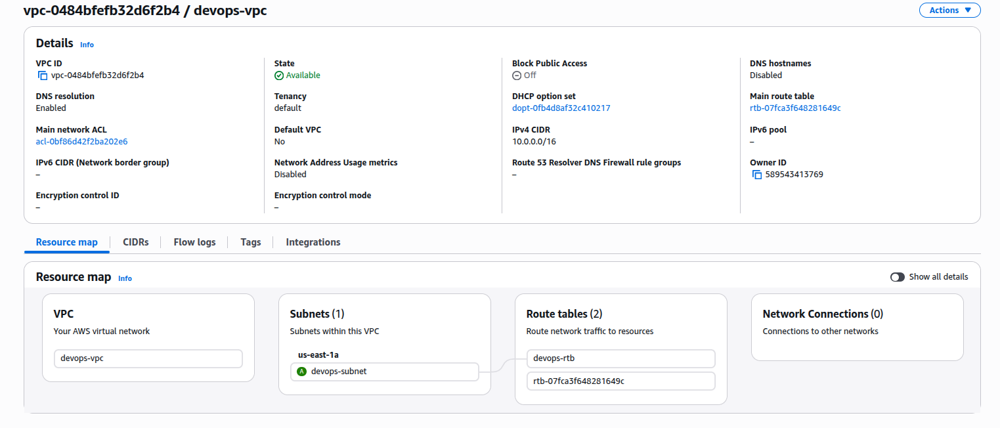
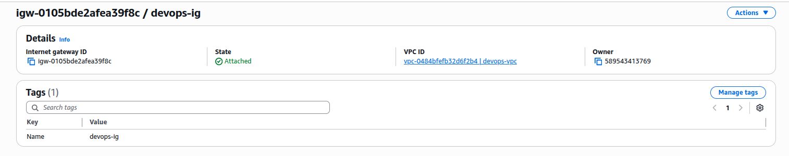

### Task

The Nautilus Development Team recently deployed a new web application hosted on an EC2 instance within a public VPC named `devops-vpc`. The application, running on an Nginx server, should be accessible from the internet on port 80. Despite configuring the security group `devops-sg` to allow traffic on port 80 and verifying the EC2 instance settings, the application remains inaccessible from the internet. The team suspects that the issue might be related to the VPC configuration, as all other components appear to be set up correctly. The DevOps team has been asked to troubleshoot and resolve the issue to ensure the application is accessible to external users.

As a member of the Nautilus DevOps Team, your task is to perform the following:

1. **Verify VPC Configuration:** Ensure that the VPC `devops-vpc` is properly configured to allow internet access.

2. **Ensure Accessibility:** Make sure the EC2 instance `devops-ec2` running the Nginx server is accessible from the internet on port 80.

### Solution

- View the resource map of the `devops-vpc` vpc. From that we can see that a internet gateway is not attached to the vpc.

  

  <br />

- Attach the internet gateway to the vpc

  ```
  VPC -> Internet gateways -> Select the relevant ig or create one -> Actions -> Attach to VPC
  ```

  

  <br />

- Visit the public ip addresss of the ec2 instance and verify the Nginx server is accessible.
