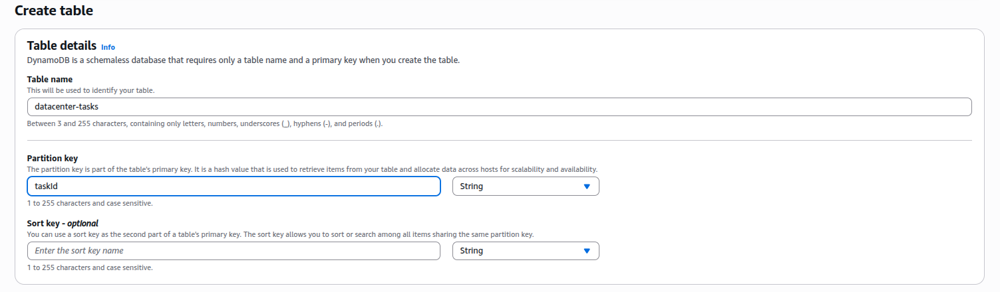
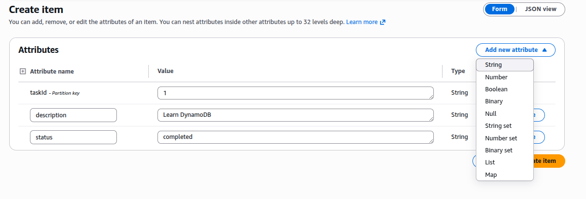
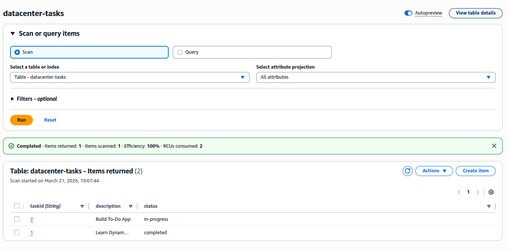

### Task

The Nautilus DevOps team is developing a simple 'To-Do' application using DynamoDB to store and manage tasks efficiently. The team needs to create a DynamoDB table to hold tasks, each identified by a unique task ID. Each task will have a description and a status, which indicates the progress of the task (e.g., 'completed' or 'in-progress').

Your task is to:

1. Create a DynamoDB table named `datacenter-tasks` with a primary key called `taskId` (string).
2. Insert the following tasks into the table:
   - Task 1: taskId: '1', description: 'Learn DynamoDB', status: 'completed'
   - Task 2: taskId: '2', description: 'Build To-Do App', status: 'in-progress'
3. Verify that Task 1 has a status of 'completed' and Task 2 has a status of 'in-progress'.

Ensure the DynamoDB table is created successfully and that both tasks are inserted correctly with the appropriate statuses.

### Solution

- Create table

  ```
  DynamoDB -> Create table
  ```

  

  <br />

- After the table is in `active` status, insert the two items.

  ```
  Select table -> Actions -> Create item
  ```

  

  <br />

- After adding both items, verify by going to `Explore table items`

  
