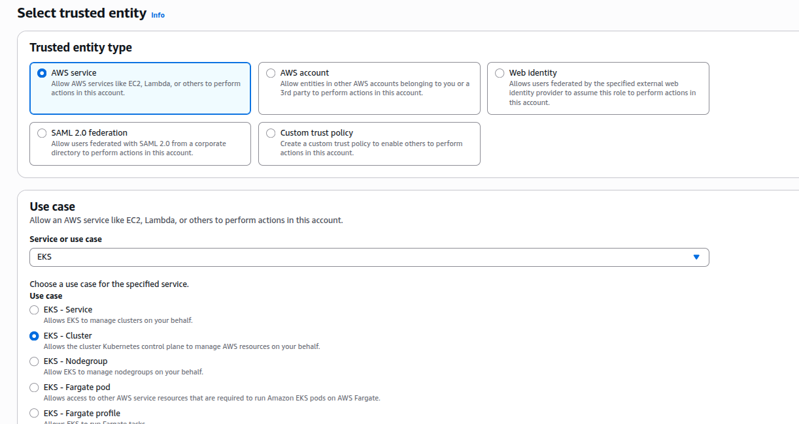
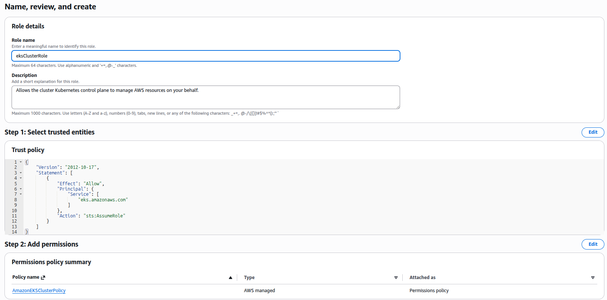
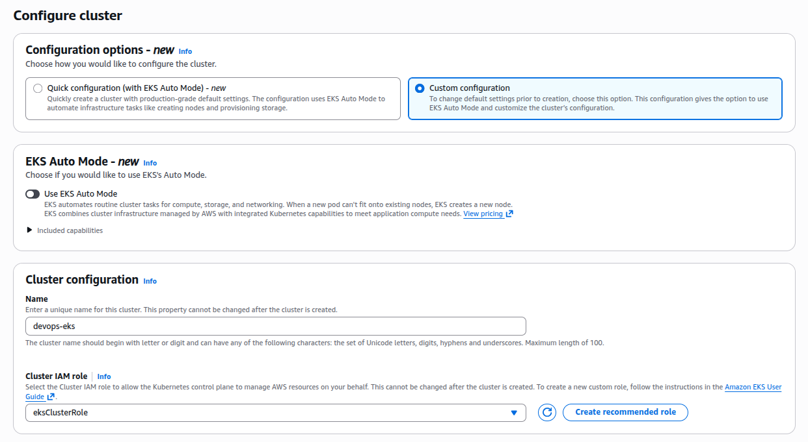
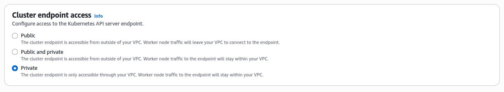
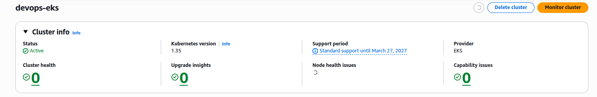

### Task

The Nautilus DevOps team has been tasked with preparing the infrastructure for a new Kubernetes-based application that will be deployed using Amazon EKS. The team is in the process of setting up an EKS cluster that meets their internal security and scalability standards. They require that the cluster be provisioned using the latest stable Kubernetes version to take advantage of new features and security improvements.

To minimize external exposure, the EKS cluster endpoint must be kept private. Additionally, the cluster needs to use the default VPC with availability zones `a`, `b`, and `c` to ensure high availability across different physical locations.

Your task is to create an EKS cluster named `devops-eks`, with Custom configuration, use IAM role for the cluster named `eksClusterRole`. Additionally, ensure that `EKS Auto Mode` is disabled and that the cluster endpoint access is set to private.

Finally, verify that the EKS cluster is successfully created with the correct configuration and is ready for workloads.

### Solution

- Create IAM role

  ```
  IAM -> Roles -> Create role
  ```

  

  <br />

  

  <br />

- Create cluster

  ```
  Amazon Elastic Kubernetes Service -> Create cluster
  ```

  

  <br />

  

  <br />

- Wait until the status is `active`

  
