### Task

The DevOps team is tasked with setting up a highly available web application using AWS. To achieve this, they plan to use an Auto Scaling Group (ASG) to ensure that the required number of EC2 instances are always running, and an Application Load Balancer (ALB) to distribute traffic across these instances. The goal of this task is to set up an ASG that automatically scales EC2 instances based on CPU utilization, and an ALB that directs incoming traffic to the instances. The EC2 instances should have Nginx installed and running to serve web traffic.

1. Create an EC2 launch template named `devops-launch-template` that specifies the configuration for the EC2 instances, including the `Amazon Linux 2 AMI`, `t2.micro` instance type, and a security group that `allows HTTP traffic on port 80`.
2. Add a `User Data` script to the launch template to install Nginx on the EC2 instances when they are launched. The script should install Nginx, start the Nginx service, and enable it to start on boot.
3. Create an Auto Scaling Group named `devops-asg` that uses the launch template and ensures a minimum of `1 instance`, desired capacity is `1 instance` and a maximum of `2 instances` are running based on `CPU utilization`. Set the target CPU utilization to `50%`.
4. Create a target group named `devops-tg`, an Application Load Balancer named `devops-alb` and configure it to listen on `port 80`. Ensure the ALB is associated with the Auto Scaling Group and distributes traffic across the instances.
5. Configure health checks on the ALB to ensure it routes traffic only to healthy instances.
6. Verify that the ALB's DNS name is accessible and that it displays the default Nginx page served by the EC2 instances.

### Solution

- Creat security groups for EC2 instance and ALB

  ```
  VPC -> Security -> Security Groups -> Create security group
  ```

  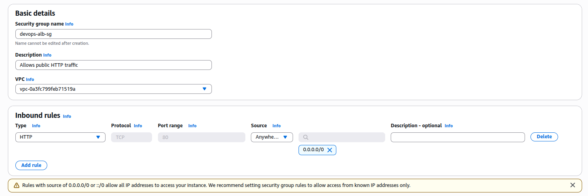

  <br />

  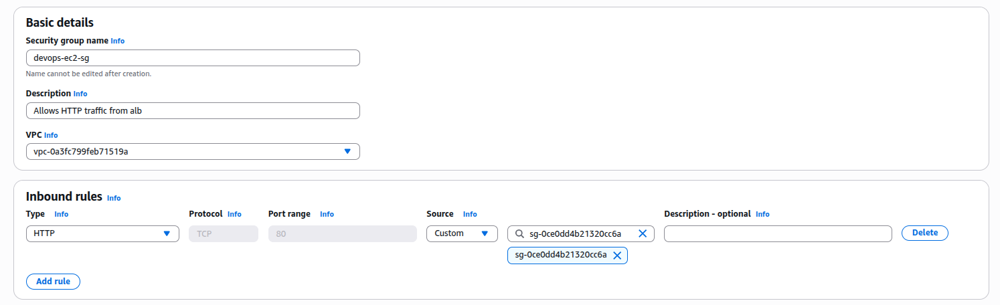

  <br />

- Create launch template

  ```
  EC2 -> Launch templates -> Create launch template
  ```

  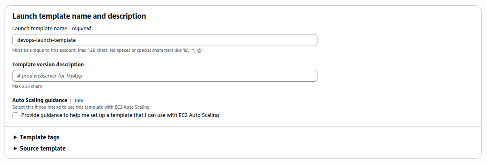

  <br />

  Amazon Linux 2 with SQL is not supported in `t2.micro`
  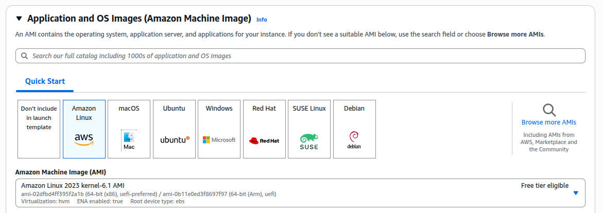

  <br />

  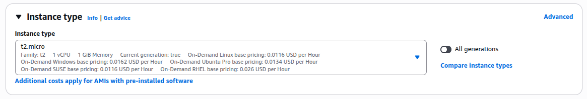

  <br />

  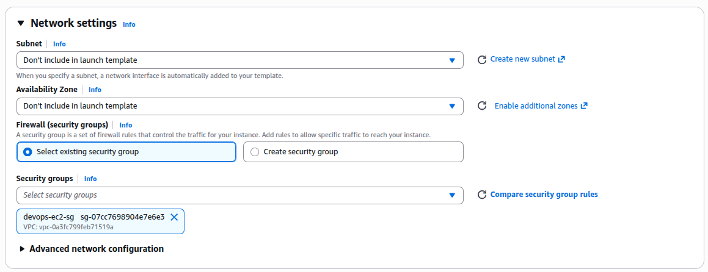

  <br />

  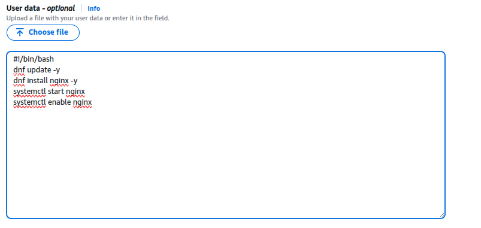

  <br />

- Create target group

  ```
  EC2 -> Load Balancing -> Target Groups -> Create target group
  ```

  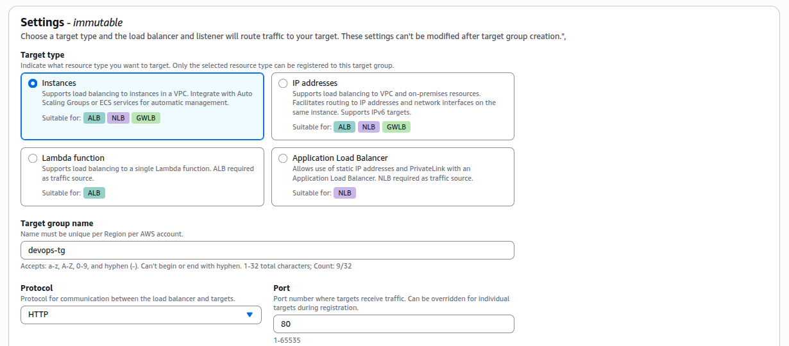

  <br />

- Create alb

  ```
  EC2 -> Load Balancing -> Load Balancer -> Create load balancer -> Application Load Balancer
  ```

  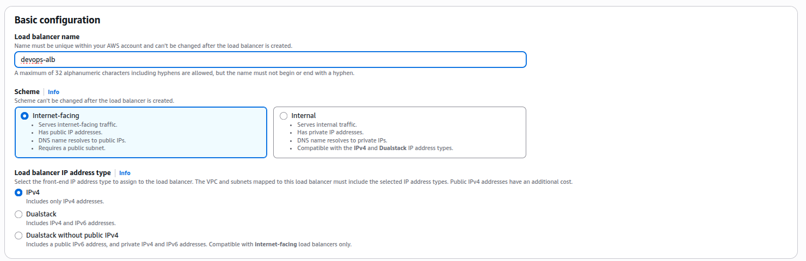

  <br />

  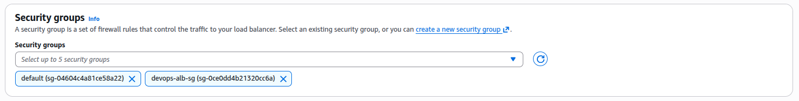

  <br />

  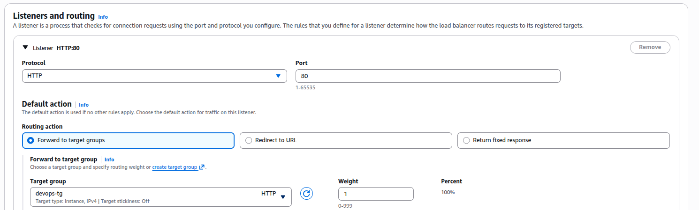

  <br />

  Select availability zones and subnets

- Create auto scaling group

  ```
  EC2 -> Auto Scaling -> Auto Scaling Groups -> Create Auto Scaling Group
  ```

  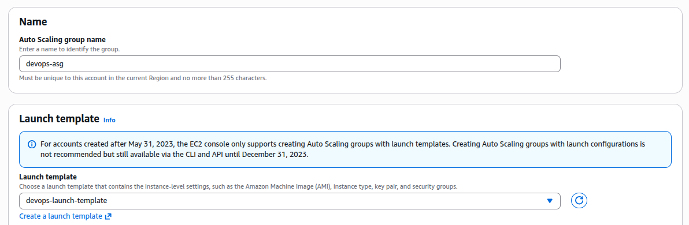

  <br />

  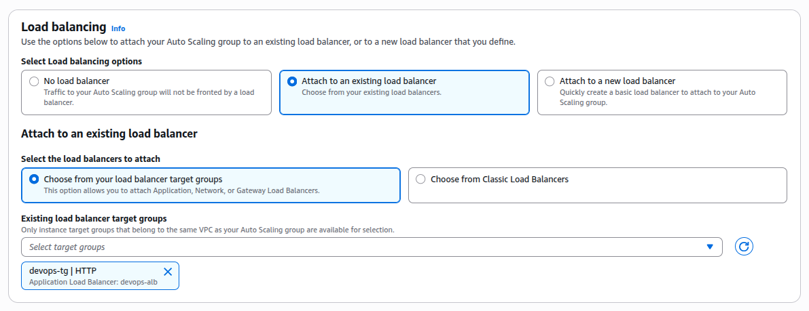

  <br />

  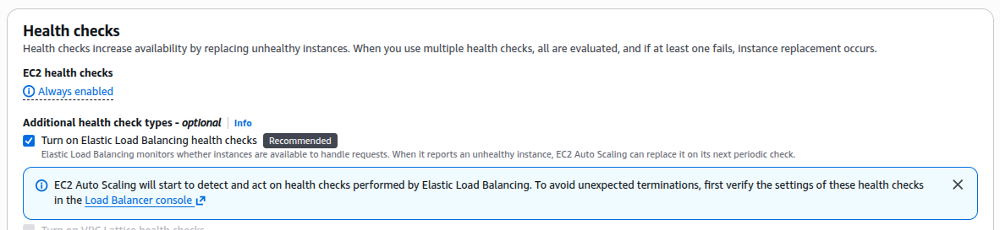

  <br />

  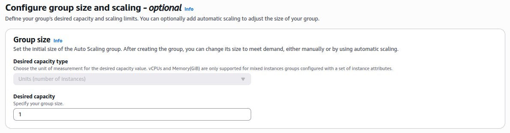

  <br />

  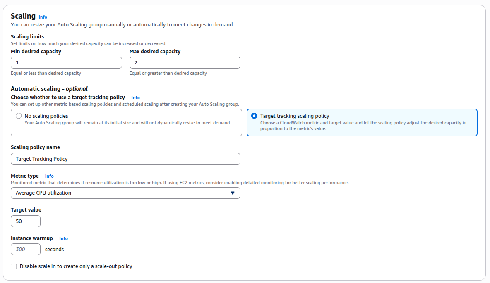

  <br />

- Get the DNS name of the alb

  ```
  EC2 -> Load Balancing -> Load Balancers -> The DNS name of the alb
  ```

- Visit the website and verify it is working
  You should see welcome msg from nginx
