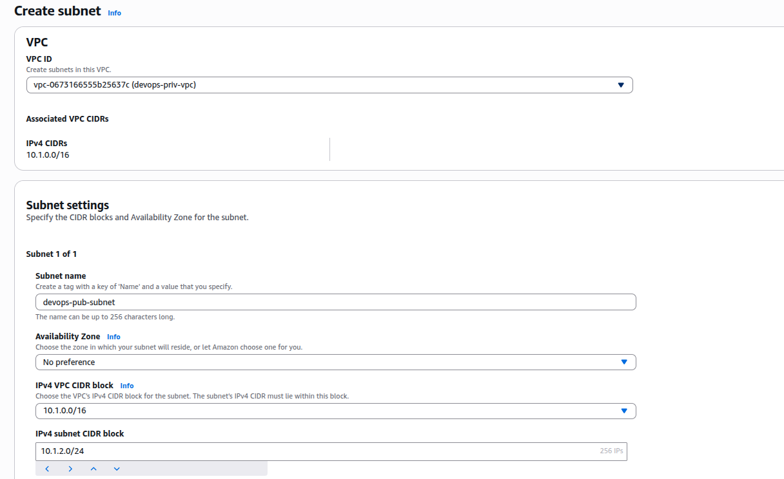
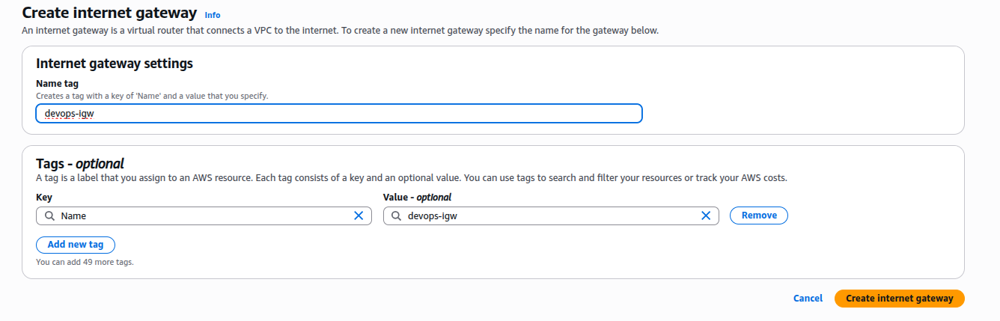
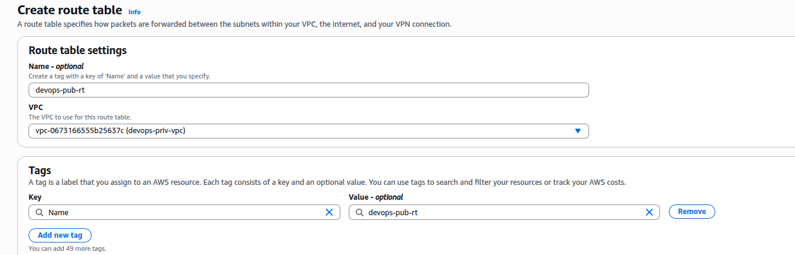
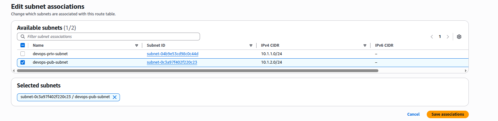
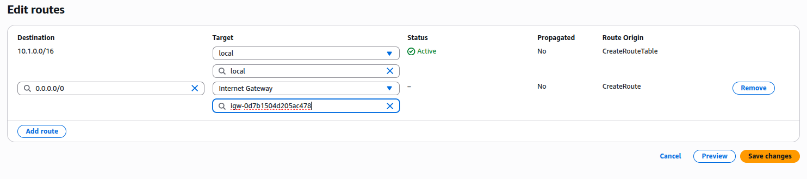
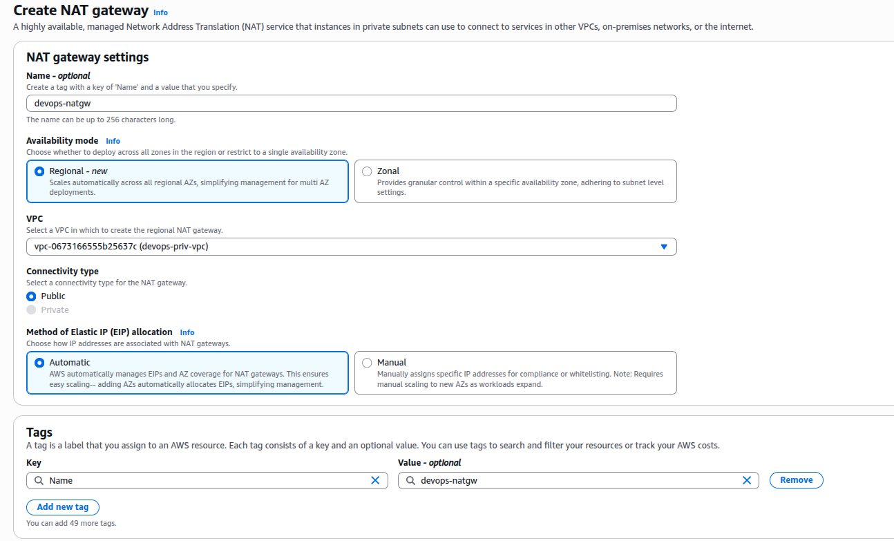
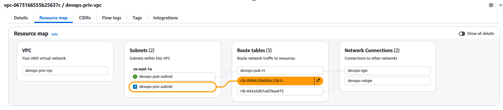
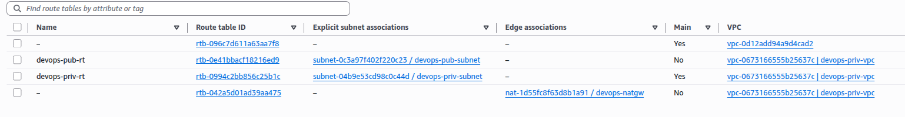
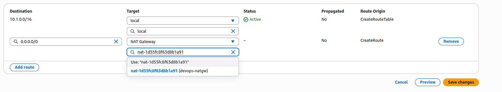
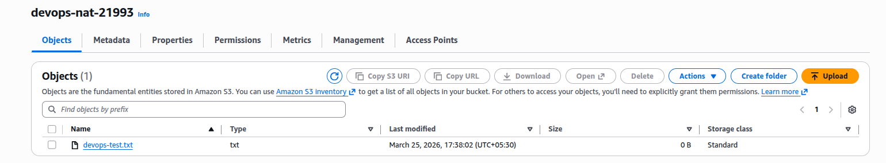

### Task

The Nautilus DevOps team is tasked with enabling internet access for an EC2 instance running in a private subnet. This instance should be able to upload a test file to a public S3 bucket once it can access the internet. To achieve this, the team must set up a NAT Gateway in a public subnet within the same VPC.

1. A VPC named `devops-priv-vpc` and a private subnet `devops-priv-subnet` have already been created.
2. An EC2 instance named `devops-priv-ec2` is already running in the private subnet.
3. The EC2 instance is configured with a cron job that uploads a test file to a bucket `devops-nat-21993` once internet is accessible.

Your task is to:

- Create a public subnet named devops-pub-subnet in the same VPC.
- Create an Internet Gateway and attach it to the VPC.
- Create a route table devops-pub-rt and associate it with the public subnet.
- Allocate an Elastic IP and create a NAT Gateway named devops-natgw.
- Update the private route table to route 0.0.0.0/0 traffic via the NAT Gateway.
- Once complete, verify that the EC2 instance can reach the internet by confirming the presence of the test file in the S3 bucket devops-nat-21993. After completing all the configuration, please wait a few minutes for the test file to appear in the bucket, as it may take 2–3 minutes.

### Solution

- Create a subnet

  

  <br />

- Create IGW and Attach it to VPC

  

  <br />

  ```
  Select IGW -> Actions -> Attach to VPC -> Select VPC
  ```

- Create route table

  

  <br />

- Associate the route table with public subnet

  

  <br />

- Make the subnet public by adding routing for internet

  

  <br />

- Create NAT gateway

  ```
  VPC -> Virtual private cloud -> NAT gateways -> Create NAT gateway
  ```

  

  <br />

- Identify route table associated with the private subnet

  

  <br />

- Associate the private route table explicitly with private subnet and update the name (optional)

  

  <br />

- Update the private route table to route 0.0.0.0/0 traffic via the NAT Gateway

  

  <br />

- Verify by visiting the s3 bucket

  

  <br />
