### Task

The DevOps team is working on automating file management between two S3 buckets. The task is to create a public S3 bucket for file uploads and a private S3 bucket for securely storing the files. A Lambda function will be triggered automatically whenever a file is uploaded to the public S3 bucket, which will copy the file to the private bucket. Additionally, logs of the operation will be stored in a DynamoDB table. The logs should include details such as the source bucket, destination bucket, and the object key of the file that was copied. This will help the team maintain better security and visibility for file transfers.

1. Create a public S3 bucket named `nautilus-public-10861`. Ensure that the bucket allows public access to its objects.
2. Create a private S3 bucket named `nautilus-private-22171`. Ensure that the bucket does not allow public access.
3. Create a Lambda function named `nautilus-copyfunction`. This function should be triggered by uploads to the public S3 bucket and should copy the uploaded file to the private bucket. Create the necessary policies and a role named `lambda_execution_role`. Attach these policies to the role, and then link this role to the Lambda function.
4. `lambda-function.py` is already present under the `/root/` directory on AWS client host, replace `REPLACE-WITH-YOUR-DYNAMODB-TABLE` and `REPLACE-WITH-YOUR-PRIVATE-BUCKET` values.
5. Create a DynamoDB table named `nautilus-S3CopyLogs` with a partition key `LogID` (string). This table will store logs generated by the Lambda function, including details such as source bucket name, destination bucket name, and object key.
6. For testing upload the file `sample.zip` located in the `/root` directory on the client host to the public S3 bucket. The Lambda function should trigger and copy the file to the private bucket.
7. Verify that the file has been successfully copied to the private bucket by checking the private bucket in the S3 console.
8. Verify that a log entry has been created in the DynamoDB table containing the file copy details.

### Solution

- Create public bucket

  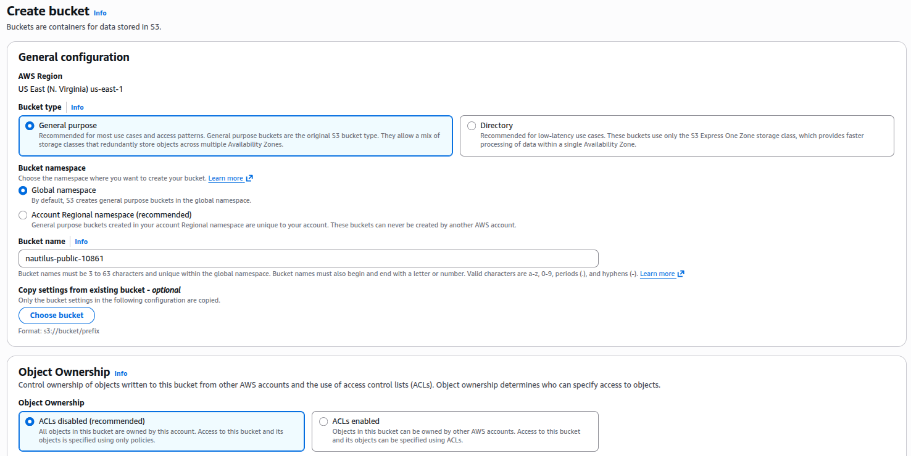

  <br />

  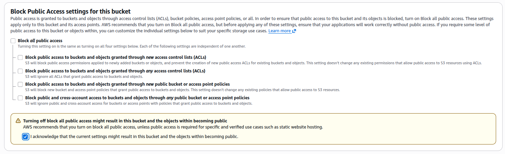

  <br />

  Add public read bucket policy

  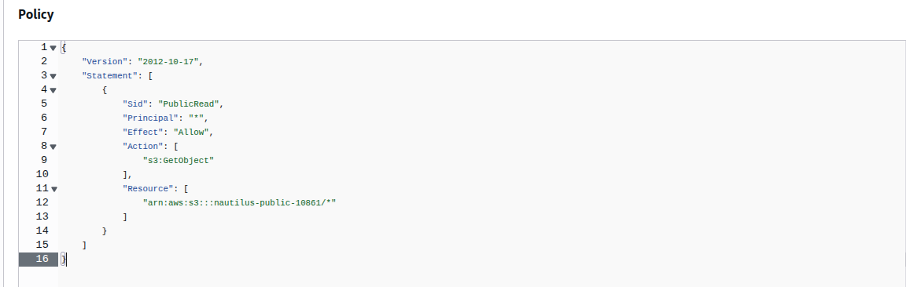

  <br />

- Create private bucket

  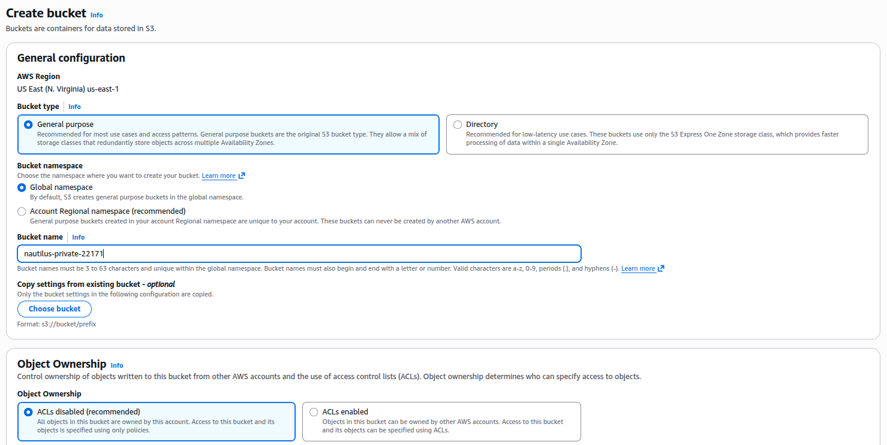

  <br />

  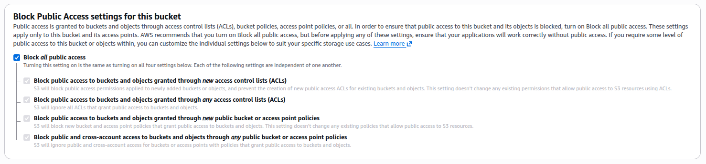

  <br />

- Create DynamoDB table

  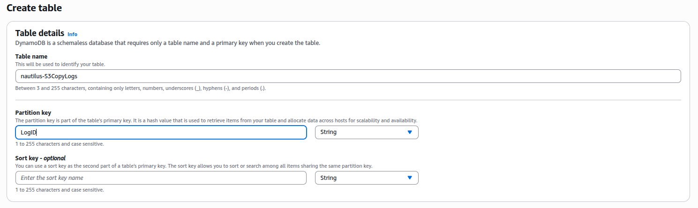

  <br />

- Create role

  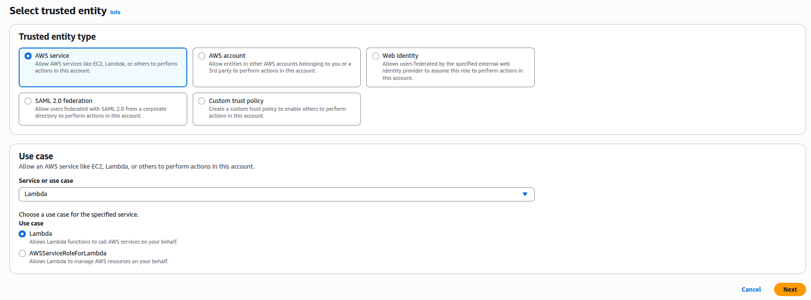

  <br />

  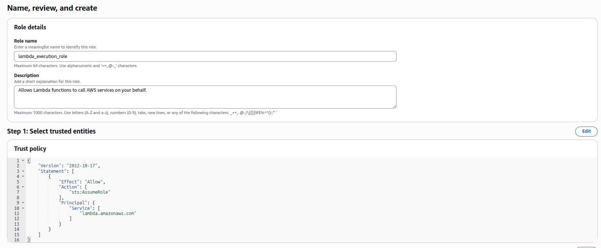

  <br />

  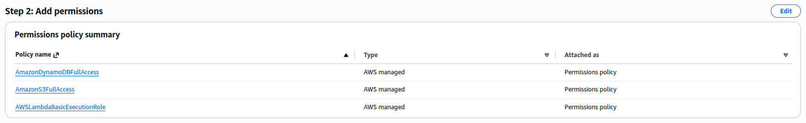

  <br />

  For production, use minimal need permissions by creating a policy with only the required permissions

- Replace the placeholders with appropriate values

  ```
  REPLACE-WITH-YOUR-DYNAMODB-TABLE -> nautilus-S3CopyLogs
  REPLACE-WITH-YOUR-PRIVATE-BUCKET -> nautilus-private-22171
  ```

- Create lambda funnction

  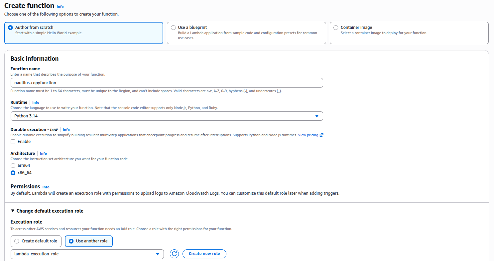

  <br />

- Zip and copy the code to the lambda function

  ```bash
  zip lambda-function.zip lambda-function.py
  aws lambda update-function-code --function-name nautilus-copyfunction --zip-file fileb:///root/lambda-function.zip
  ```

- Update the lambda function handler to `lambda-function.lambda_handler`

  ```
  Runtime settings -> Edit
  ```

  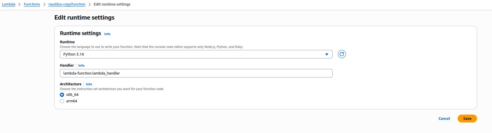

  <br />

- Add trigger

  ```
  Lambda -> Configuration -> Triggers -> Add trigger
  ```

  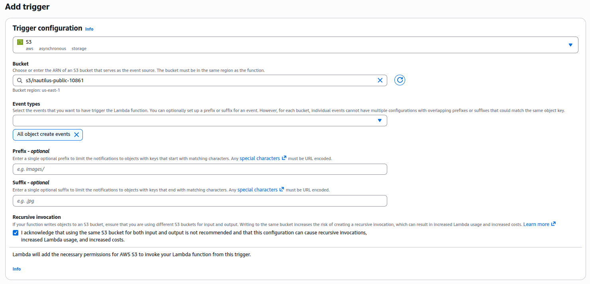

  <br />

- Upload the test file to public s3

  ```bash
  aws s3 cp /root/sample.zip s3://nautilus-public-10861/
  ```

- Verify by ensuring the logs are present in the DynamoDB table and the object is copied to the private bucket
